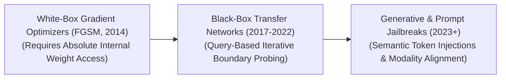
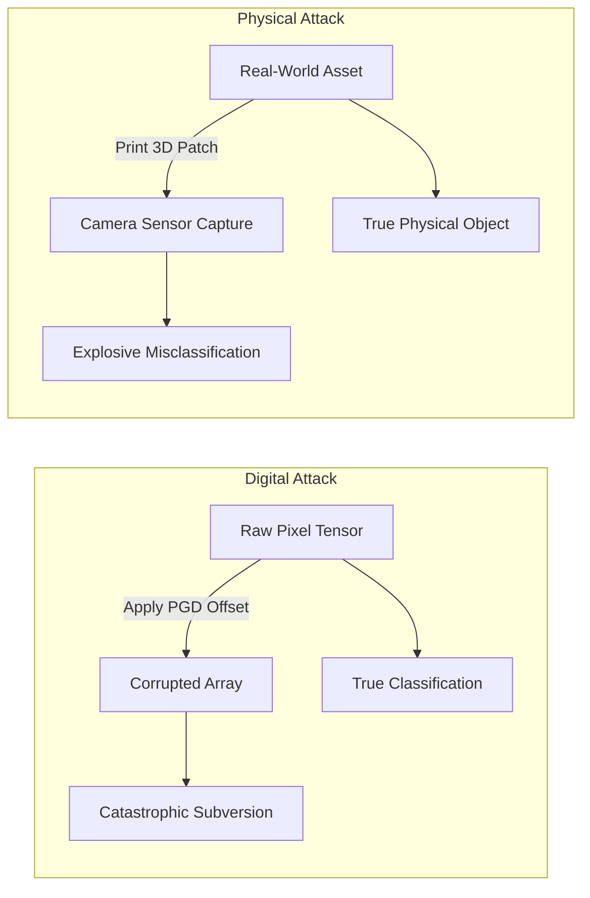

# Awesome-Adversarial-Attacks
## Adversarial Attacks in AI: History, Progression, Variants, & Applications

An Adversarial Attacks framework represents a specialized field of AI security and robustness testing dedicated to intentionally manipulating machine learning models into making catastrophic errors. By injecting microscopic, precisely engineered perturbations—often completely imperceptible to human senses—into input tensors (such as images, audio streams, or text prompts), an attacker can completely corrupt a model's latent representations. Over the history of AI, adversarial exploits have evolved from theoretical white-box optimization tricks on static image classifiers to scalable black-box transfers, prompt injection vectors on foundational Large Language Models (LLMs), and spatial physical-world overrides on autonomous vehicle vision arrays.

---

## 1. The Macro Chronological Evolution

The technical methodology of adversarial disruption has transitioned from hand-crafted gradient optimization vectors to distributed black-box approximations and native multi-modal semantic jailbreaks.

| Era | Description / Details | Year First Used | First Paper |
| :--- | :--- | :--- | :--- |
| **The Analytical White-Box Era (FGSM / PGD, ~2014–2017)** | **Concept:** The foundation of adversarial machine learning. Goodfellow et al. discovered that neural networks exhibit a vulnerability to linear input perturbations. They introduced the **Fast Gradient Sign Method (FGSM)**, which calculates the derivative of the model's loss function with respect to the input pixels, taking a single, rapid step in the direction that *maximizes* error. This was formalized into **Projected Gradient Descent (PGD)**, an iterative, fine-grained multi-step optimization loop that acts as the ultimate first-order adversarial boundary test.  **Limitation:** Required complete "white-box" access—meaning the attacker must have absolute visibility over the network's hidden layer weights and computational graphs to backpropagate gradients. | 2013 | [Szegedy et al. (2013)](https://arxiv.org/abs/1312.6199) / [Goodfellow et al. (2014)](https://arxiv.org/abs/1412.6572) |
| **The Query-Based & Black-Box Transfer Era (~2017–2022)** | **Concept:** Overcame the white-box limitation. Attackers proved that adversarial perturbations are **transferable**: an attack generated against a local substitute model (a clone network) can successfully fool a completely separate, hidden commercial API. This era introduced **Query-Based Attacks** (like NES or HopSkipJump), which use zero-order optimization to probe a protected API's decision boundaries iteratively purely by monitoring changes in the output classification scores. | 2016 | [Papernot et al. (2016)](https://arxiv.org/abs/1605.07277) |
| **The Generative, Multi-Modal, & Prompt Injection Era (~2023–Present)** | **Concept:** The modern state-of-the-art security threat matrix. With the rise of foundation LLMs and Vision-Language Models (VLMs), attacks shifted from pixel-level alterations to semantic token manipulation. This introduced **Indirect Prompt Injection** (hiding malicious system overrides inside third-party documents) and **Cross-Modal Attacks**. For instance, an attacker can patch an image with a specific pixel noise layer that causes a VLM's vision encoder to override its text system prompt completely, executing hidden, remote code commands. | 2023 | [Greshake et al. (2023)](https://arxiv.org/abs/2302.12173) |

---

## 2. Core Strategic & Access-Level Variants

Adversarial operations are strictly categorized based on the volume of architectural parameters the adversary can audit or influence during the attack cycle.

| Variant | Mechanism & Details | Year First Used | First Paper |
| :--- | :--- | :--- | :--- |
| **A. White-Box Attacks** | **Mechanism:** The adversary possesses absolute mathematical visibility over the target model's infrastructure, including weights, activation curves, layers, and optimization matrices. The attacker directly runs backpropagation loops over the input space to find the exact global minimum distortion needed to break the model.  **Key Algorithms:** FGSM, PGD, Carlini-Wagner (C&W) L2 loss, and DeepFool. | 2013 | [Szegedy et al. (2013)](https://arxiv.org/abs/1312.6199) |
| **B. Black-Box Attacks** | **Mechanism:** The target model sits behind an impenetrable wall (such as a restricted cloud API endpoint). The adversary can only feed inputs and capture the terminal outputs (either soft log-probabilities or hard string tokens).  **Sub-Types:** 1. *Score-Based:* Uses finite-difference calculus to approximate gradients from output probability variations. 2. *Decision-Based:* Probes the strict geometric borders of a classification threshold. 3. *Transfer-Based:* Trains an offline shadow model to synthesize transferable exploits. | 2016 | [Papernot et al. (2016)](https://arxiv.org/abs/1605.07277) |
| **C. Gray-Box Attacks** | **Mechanism:** A hybrid configuration. The attacker lacks access to the exact weights of the system but understands the underlying model family type, tokenization vocabulary matrix, or historical training data distribution. | 2018 | [Vivek et al. (2018)](https://arxiv.org/abs/1809.03722) |

---

## 3. Physical-Spatial & Data-Modality Types

Depending on how the mathematical perturbations intersect with real-world sensors or linguistic tokens, adversarial execution maps across distinct operational tracks.

| Type | Profile | Year First Used | First Paper |
| :--- | :--- | :--- | :--- |
| **Digital-Tensor Perturbations** | Modifies data arrays at the pure software level before inference occurs. The mathematical distortion is bounded by a maximum scale threshold ($\epsilon$, typically measured via $L_\infty$ or $L_2$ vector norms), ensuring the image matrix looks visually unaltered to human auditors. | 2013 | [Szegedy et al. (2013)](https://arxiv.org/abs/1312.6199) |
| **Physical-World Spatial Patches** | Bypasses digital injection entirely by printing physical assets. Attackers deploy specialized 3D textures, geometric stickers, or customized wearable clothing patterns (e.g., adversarial eyeglasses or patches). When a camera sensor frames the scene, the physical patterns alter the sensory input stream natively, triggering systemic misclassifications under variable real-world lighting and camera tilts. | 2016 | [Kurakin et al. (2016)](https://arxiv.org/abs/1607.02533) |
| **Linguistic Tokens & Prompt Injections** | Tailored for text processing engines. It implements **Direct Prompt Injection** (user intentionally commands the model to bypass safety guardrails) or **Indirect Prompt Injection** (embedding hidden instructions inside a website or PDF that an autonomous agent reads while performing data extraction tools, causing the agent to execute unauthorized transactions). | 2022 | [Perez & Ribeiro (2022)](https://arxiv.org/abs/2211.09527) |

---

## 4. Production Engineering Challenges & Hardening Countermeasures

Securing high-throughput commercial AI architectures against adversarial exploitation requires balancing model processing speed with structural parameters defense.

| Hardening Countermeasure | Strategy / Bottleneck / Mitigation | Year First Used | First Paper |
| :--- | :--- | :--- | :--- |
| **Adversarial Training (The Ultimate Safety Rail)** | **The Strategy:** Formally treats optimization as a minimax game: min-maxing loss over an inner maximization loop. During every pre-training batch pass, the system dynamically calculates PGD adversarial variants of the data, forcing the model to explicitly minimize loss *over those corrupted parameters*.  **The Bottleneck:** Extremely computationally expensive, increasing baseline model training duration by over $3\times$ to $10\times$ due to continuous multi-step gradient calculations. | 2014 | [Goodfellow et al. (2014)](https://arxiv.org/abs/1412.6572) |
| **The Robustness vs. Accuracy Trade-Off (The Alignment Tax)** | **The Problem:** Research proves a structural mathematical tension exists between adversarial hardening and clean accuracy bounds. Models heavily hardened via adversarial training often exhibit minor performance drops on standard, non-corrupted human datasets.  **Mitigation:** Implementing **TRADES optimization loss functions**, which introduce a tunable regularization dial to let infrastructure teams balance clean data precision against strict certified robustness ceilings. | 2019 | [Zhang et al. (2019)](https://arxiv.org/abs/1901.08573) |
| **Input Smoothing & Logit Randomization Layers** | **The Strategy:** Implements lightweight front-end defensive filters. Incoming data arrays undergo dynamic **Randomized Smoothing** (adding Gaussian noise and running statistical aggregation), **Autoencoding Denoising**, or token-level vocabulary perplexity checks to neutralize malicious low-level mathematical signals before they reach deep layer matrices. | 2019 | [Cohen et al. (2019)](https://arxiv.org/abs/1902.02918) |

---

## 5. Frontier Real-World AI Security Applications

| Application | Description & Mitigation | Year First Used | First Paper |
| :--- | :--- | :--- | :--- |
| **Autonomous Vehicle Perception Spoofing Mitigation** | **Application:** Hardens the computer vision perception stacks of autonomous vehicles against physical road exploits. Security engineering loops test cameras against universal adversarial stickers (such as localized patch patterns applied to stop signs that fool standard CNNs into reading a speed limit sign), utilizing multi-scale adversarial training to guarantee safe navigation bounds. | 2017 | [Eykholt et al. (2017)](https://arxiv.org/abs/1707.08945) |
| **Enterprise Document and GUI Agent Safety Enforcement** | **Application:** Secures autonomous multi-agent tool orchestration networks. Processing engines scan multi-column corporate PDFs and web scraped content using strict **Indirect Prompt Injection Filters**, preventing hidden embedded scripts from hijacking the agent's function-calling privileges to execute unauthorized local backend file changes. | 2023 | [Greshake et al. (2023)](https://arxiv.org/abs/2302.12173) |
| **Biometric Facial Recognition Evasion Auditing** | **Application:** Secures authentication infrastructure. Security infrastructure modules evaluate high-security physical checkpoints against adversarial eyewear frames or mask textures engineered to mimic alternative user identities, executing localized token-level focus maps to verify physical liveness parameters. | 2016 | [Sharif et al. (2016)](https://www.cs.cmu.edu/~sbhagava/papers/face-rec-ccs16.pdf) |

---

## References
1. Szegedy, C., et al. (2013). Intriguing properties of neural networks. *arXiv preprint arXiv:1312.6199*.
2. Goodfellow, I. J., Shlens, J., & Szegedy, C. (2014). Explaining and harnessing adversarial examples. *International Conference on Learning Representations (ICLR)*.
3. Madry, A., et al. (2018). Towards deep learning models resistant to adversarial attacks. *International Conference on Learning Representations (ICLR)*.
4. Carlini, N., & Wagner, D. (2017). Towards evaluating the robustness of neural networks. *IEEE Symposium on Security and Privacy (SP)*, 39-57.
5. Zhang, H., et al. (2019). Theoretically principled trade-off between robustness and accuracy. *International Conference on Machine Learning (ICML)*, 7472-7482.
6. Greshake, K., et al. (2023). Not what you ve read: Devising indirect prompt injection attacks on large language models. *arXiv preprint arXiv:2302.12173*.

---

To advance this documentation repository, secure development context, or threat-modeling framework, consider exploring these adjacent development pathways:
* Build a **Python script using PyTorch and Torchattacks** demonstrating how to calculate and apply a multi-step Projected Gradient Descent (PGD) adversarial perturbation mask over a localized image tensor block.
* Generate a **comprehensive Markdown table** explicitly analyzing White-Box PGD, Black-Box Boundary Probing, Direct Prompt Injection, and Cross-Modal VLM Attacks across vector constraints, computational attack budgets, infrastructure entry vectors, and defense mitigation effectiveness.
* Establish a **fused automated defensive pipeline using Triton** to profile exactly how interleaving front-end randomized smoothing filters impacts the wall-clock processing latency of live concurrent user generation pre-fills.

***

**Proactive Repository Follow-Ups:**

To assist with your documentation repository setup, let me know how you would like to proceed by choosing one of the options below:
* I can provide a **complete Python code boilerplate using PyTorch** demonstrating how to write a manual Fast Gradient Sign Method (FGSM) white-box attack function from scratch.
* I can generate a **Markdown matrix table** analyzing the resilience scores of the leading open-weight vision-language models against downstream cross-modal prompt injections.
* I can write a detailed technical explanation focusing on **how to construct an automated red-teaming orchestrator** using adversarial multi-agent graphs to evaluate corporate API robust metrics.

