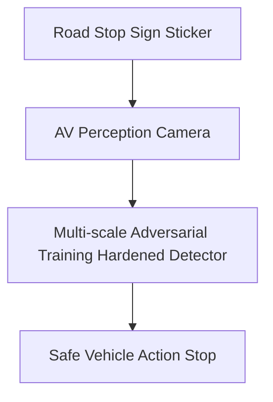

# Autonomous Vehicle Perception Spoofing Mitigation

## Overview
Applies robustness defenses to self-driving camera and LiDAR vision grids against real-world adversarial road signs.

## Workflow & Process Diagram

## Detailed Insights
- **Key Characteristics:** This represents a foundational pillar in understanding adversarial machine learning threats and mitigation strategies.
- **Security Implications:** Essential for threat modeling, red-teaming, and developing robust defensive layers.
- **Future Directions:** Research continues to evolve, adapting these concepts to advanced multi-modal and agentic architectures.

[← Back to README](../README.md)
