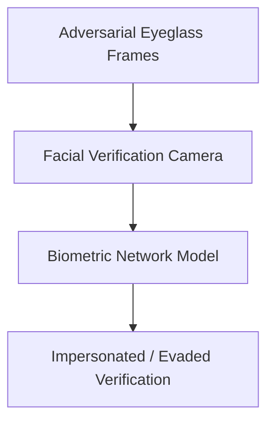

# Biometric Facial Recognition Evasion Auditing

## Overview
Tests validation gates against adversarial spectacles, makeup, and masks designed to bypass or impersonate users.

## Workflow & Process Diagram

## Detailed Insights
- **Key Characteristics:** This represents a foundational pillar in understanding adversarial machine learning threats and mitigation strategies.
- **Security Implications:** Essential for threat modeling, red-teaming, and developing robust defensive layers.
- **Future Directions:** Research continues to evolve, adapting these concepts to advanced multi-modal and agentic architectures.

[← Back to README](../README.md)
