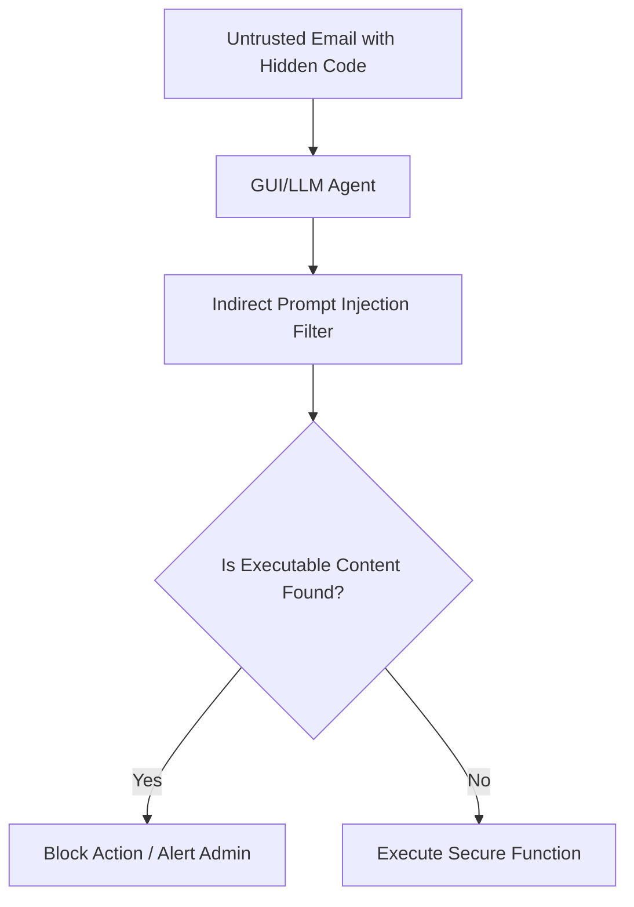

# Enterprise Document and GUI Agent Safety Enforcement

## Overview
Secures LLM and visual agent tools executing functions over untrusted web documents and emails.

## Workflow & Process Diagram

## Detailed Insights
- **Key Characteristics:** This represents a foundational pillar in understanding adversarial machine learning threats and mitigation strategies.
- **Security Implications:** Essential for threat modeling, red-teaming, and developing robust defensive layers.
- **Future Directions:** Research continues to evolve, adapting these concepts to advanced multi-modal and agentic architectures.

[← Back to README](../README.md)
